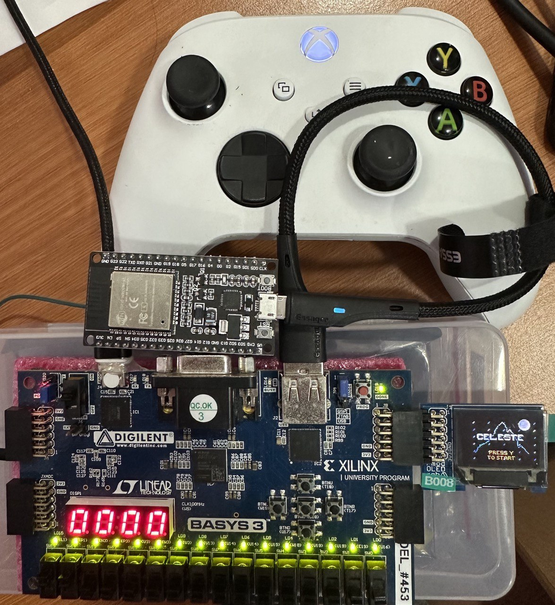
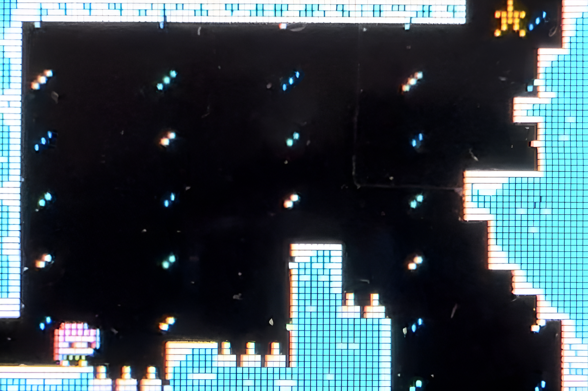
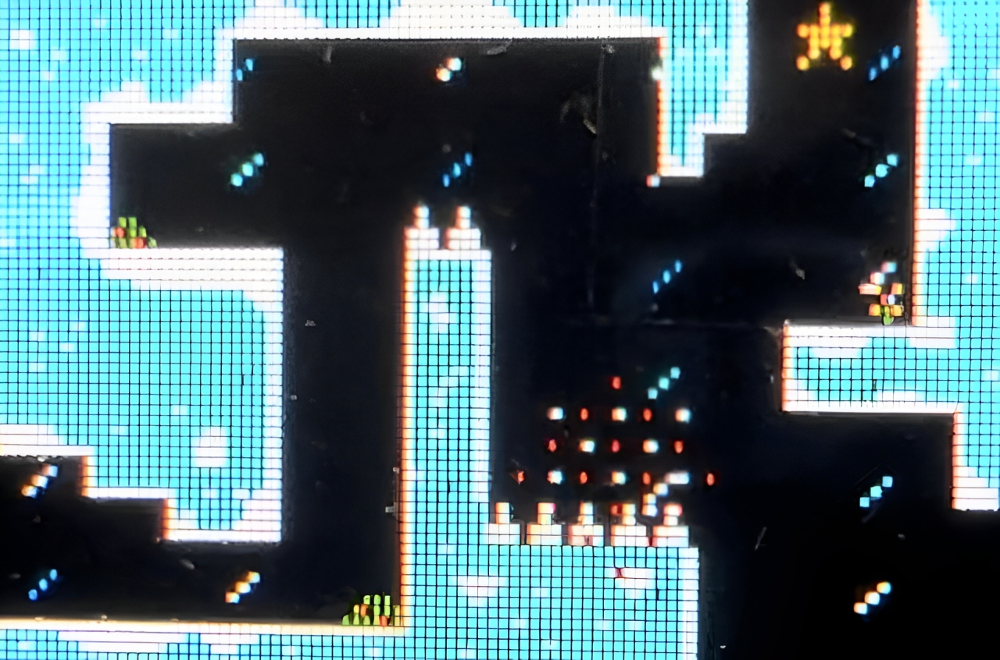
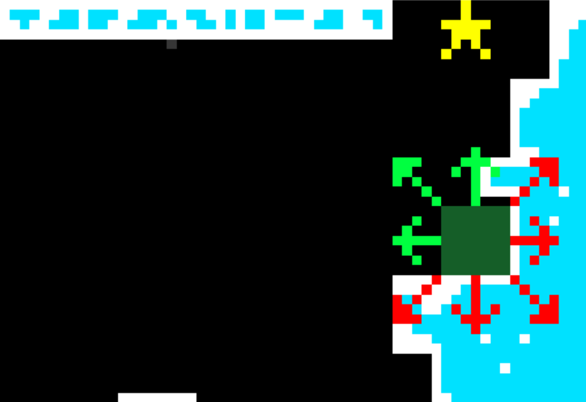
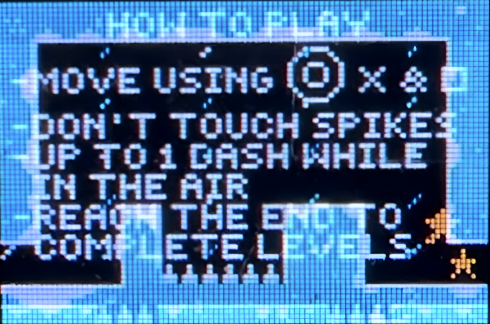

# 🎮 Celeste FPGA: A 2D Platformer on Basys3

> A Verilog-based 2D platformer game inspired by *Celeste*, recreated on the Basys3 FPGA board with a PMOD OLED display and Xbox controller input.

---

## 🚀 Quick Start

1. Connect the **PMOD OLED** to the JB port of the **Basys3 board** with the bitstream flashed into it.
2. Turn on the **ESP32**, preloaded with Bluepad32 firmware.
3. Wirelessly pair your **Xbox Controller**.
4. Press `Y` on the controller to start the game!

---

## 🎮 Controls

| Action     | Button             |
|------------|--------------------|
| Jump       | `A`                |
| Dash       | `X` + Analog Stick |
| Move       | Left Analog Stick  |
| Start/Reset| `Y`                |

- **Dash** is only usable once in mid-air. Resets when grounded.
- **Death** triggers explosion and respawn with blinking invulnerability.
- **Objective** is to reach the end of each level.

---

## 🧪 Developer Mode

Activate by flipping **SW[15] ON** on the Basys3 board.

| Switch | Action               |
|--------|----------------------|
| SW[0]  | Jump to Level 0      |
| SW[1]  | Jump to Level 1      |
| SW[2]  | Jump to Level 2      |
| SW[3]  | Jump to Level 3      |
| SW[4]  | Jump to End Screen   |
| SW[14] | Return to Home Screen|

> 🔁 Switches are one-hot encoded: Use only **one switch at a time** for smooth transitions.

---

## ✨ Features

### 🌧️ Rain Animation
A procedural effect where each pixel's vertical position is offset over time to create falling rain.

---

### 💥 Explosion & Respawn
On death, an animated explosion plays followed by a blinking invulnerability phase.

---

### 🏃 Sprite Animation & FSM
- **Normal State:** Responsive to movement
- **Explosion State:** Expanding visual effect
- **Blink State:** Temporary invulnerability and level transitions

---

### 🧱 Collision Detection
- Modular functions: `is_dead`, `is_level_done`, `is_obstructed`
- 8-directional collision flag system
- Works across all four levels

---

### ⛅ Level Transitions
Smooth fade-in/fade-out using linear RGB565 interpolation.

Example: Fade animation between level 0 and level 1.

---

### 🕹️ Xbox Controller via ESP32
- Controller inputs processed by **Bluepad32** and transmitted via **UART**.
- Buttons encoded into a byte and decoded on FPGA side using a Verilog module.

---

### 💀 Death Counter
- 7-segment display shows number of deaths.
- Automatically resets in Level 0 (Tutorial).

---

## 📚 References

- 🎨 [Pixilart](https://www.pixilart.com/): For sprites & backgrounds  
- 🕹️ [Bluepad32](https://github.com/ricardoquesada/esp-idf-arduino-bluepad32-template): For controller connectivity
- 🎮 [PICO-8 Celeste](https://www.lexaloffle.com/bbs/?tid=2145): Original 8-bit inspiration  

---
